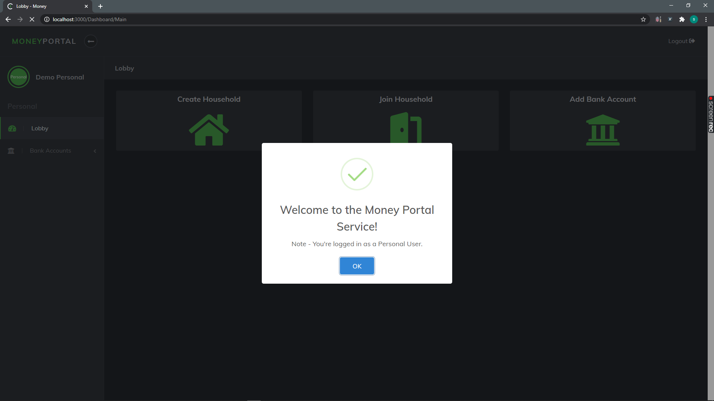

# MoneyPortal-Service-Application

MoneyPortal is a financial web application complete with bank accounts, budgets & graphing. It utilities a role-based security system to create permission-based roles. The role of Owner, Member, and Personal restricts what the user can see and do.  This project is developed by following the MVC pattern. Application utilities Express & NodeJs as backend where frontend utilities Handlebars & Css and MongoDb is used as the database.

### Welcome to Money Portal #

# Application Features.
**Capabilities includes:**
    
  **Personal Role Permissions**
 - When user is logged in as Personal:
    - Add a Bank Account
    - Create Transactions
    - Edit Transaction Details
    - Delete Transactions
    - Delete Bank Account
    - Update Bank Account Details
    
   **Member Role Permissions**
   - When user is logged in as a Member:
    - Includes all Personal role features.
    - Link or Unlink their Bank Account to the Household.
    - Permissions to assign Budget to the House transactions.
    - Permissions the Leave Household.
    
    **Owner Role Permissions**
   - When user is logged in as the Owner:
    - Includes all Personal role features.
    - Link or Unlink anyones Bank Account to the Household.
    - Permission to Invite Members via email attach with a greeting message.
    - Permission to create new Budget Categories & Budget Items to the Household.
    - Permission to assign Budget to the House transactions.
    - Permission to Delete the Household.
    
    
# Screenshots

# MANUAL INSTALLATION

- Create new project.
- Copy+Paste all files into project.
- Install all node modules.
- Run command: node app.js
